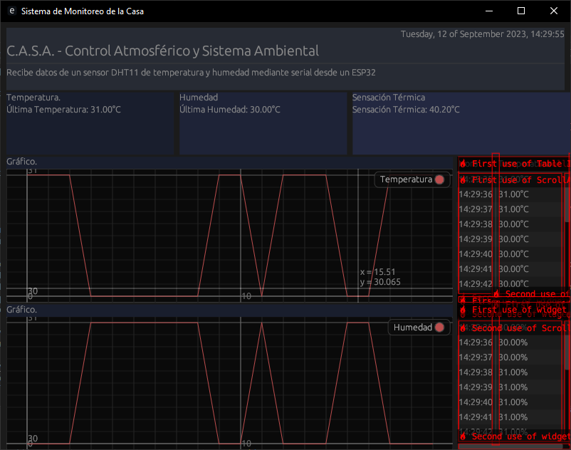

### README para Sistema de Monitoreo de la Casa

#### Propósito del Proyecto
El proyecto "Sistema de Monitoreo de la Casa" (C.A.S.A. - Control Atmosférico y Sistema Ambiental) tiene como objetivo monitorear la temperatura y la humedad del ambiente en tiempo real. Utiliza un sensor DHT11 y un ESP32 para recopilar datos y los muestra en una interfaz gráfica.

#### Cómo Ejecutar la Aplicación
1. Asegúrese de tener instaladas las dependencias necesarias (`eframe`, `egui`, `chrono`, `serialport`, etc.).
2. Compile el proyecto con `cargo build`.
3. Ejecute el proyecto con `cargo run`.

#### Captura de Pantalla y Funcionamiento

La pantalla principal muestra la hora local y el título del proyecto. Se muestran los datos más recientes de temperatura, humedad y sensación térmica en un menú. Luego se encuentran los graficos y las tablas que muestra la evolución de la temperatura y humedad en el tiempo.

#### Características del Código

- Utiliza una cola `VecDeque` para almacenar las últimas 20 mediciones.
- Usa el puerto serial "COM3" para recibir datos.
- Incluye gráficos en tiempo real para temperatura y humedad.